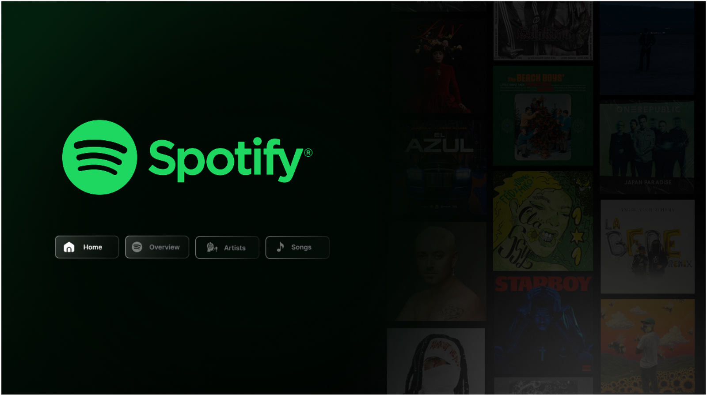
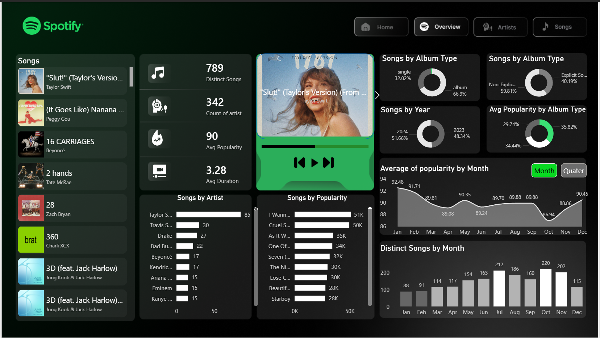
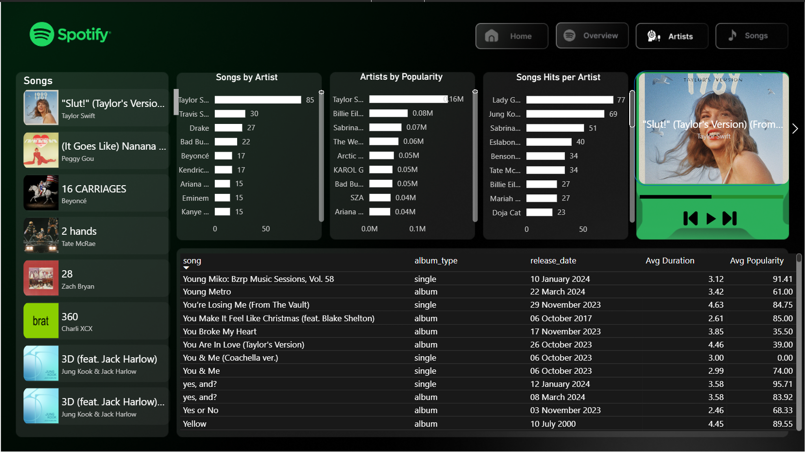
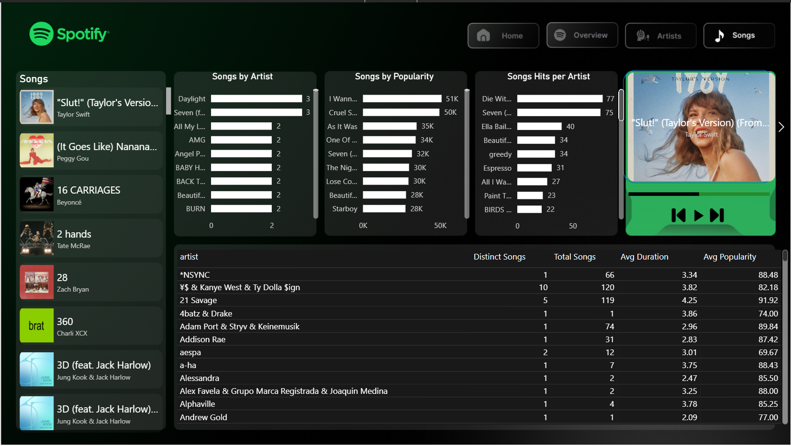

# Spotify-Dashboard

# 🎧 Spotify Streaming Analytics – Power BI Dashboard

## 1. Project Overview
**Spotify Streaming Analytics – Power BI Dashboard** is an interactive, data-driven analytics dashboard built in Power BI to analyze global Spotify Top-50 streaming trends. The dashboard focuses on artist popularity, song performance, release patterns, and temporal trends to uncover insights into music consumption behavior over time.

This project is designed as a **portfolio-grade analytics case study**, aimed at data analysts and recruiters evaluating real-world Power BI, DAX, and data modeling skills.

---

## 2. Purpose of the Dashboard
The purpose of this dashboard is to:
- Analyze **artist and song popularity trends** on Spotify  
- Identify **seasonal and time-based patterns** in music releases  
- Compare artists based on **song count, popularity, and consistency**  
- Demonstrate strong **Power BI dashboard design and analytical thinking**

This dashboard converts raw streaming data into actionable insights through intuitive visual storytelling.

---

## 3. Tech Stack
The dashboard was built using the following tools and technologies:

- 📊 **Power BI Desktop** – Primary tool for dashboard development and visualization  
- 🔄 **Power Query** – Data cleaning, transformation, and shaping  
- 🧠 **DAX (Data Analysis Expressions)** – Custom measures for popularity metrics, time-based analysis, and aggregations  
- 🧩 **Data Modeling** – Optimized relationships to enable efficient filtering and drill-down analysis  
- 📁 **File Formats**
  - `.pbix` – Power BI report  
  - `.png` – Dashboard preview images  

---

## 4. Data Source
**Dataset:** Spotify Top 50 – World  
**Source:** Kaggle  
🔗 https://www.kaggle.com/datasets/yogeshyadavv/spotify-top-50-world  

### Dataset Details
- **Time Range:** May 18, 2023 – November 27, 2024  
- **Rows:** ~27,800  
- **Unique Tracks:** 794  
- **Unique Artists:** 343  

The dataset includes information such as song popularity, artist names, album types, release dates, and duration, enabling multi-dimensional music trend analysis.

---

## 5. Features & Highlights

### • Business Problem
Spotify generates massive volumes of streaming data, but extracting **clear insights about artist dominance, release trends, and popularity patterns** is difficult without structured analysis. Raw data alone does not reveal which artists consistently dominate charts, when songs are most frequently released, or how popularity evolves.

---

### • Goal of the Dashboard
To deliver an interactive analytics tool that:
- Highlights **top-performing artists and songs**  
- Reveals **monthly, quarterly, and yearly release patterns**  
- Enables comparison of artists by **song volume and popularity**  
- Serves as a **recruiter-ready analytics portfolio project**

---

#### 📊 Overview Page
**Key KPIs**
- Distinct Songs  
- Count of Artists  
- Average Popularity  
- Average Song Duration  

**Key Visuals**
- Songs by Year (Bar Chart)  
- Songs by Album Type (Donut Chart)  
- Songs by Popularity (Bar Chart)  
- Time-based slicers for dynamic exploration  

---

#### 🎤 Artist Analysis Page
**Insights-driven visuals**
- Songs by Artist  
- Artists by Average Popularity  
- Songs vs Popularity comparison  
- Tables ranking artists by volume and impact  

This page highlights **artist dominance and consistency**, not just one-hit popularity.

---

#### 🎵 Songs Analysis Page
- Distinct Songs by Month & Quarter (Line Charts)  
- Average Popularity by Month & Quarter  
- Songs by Release Month  
- Detailed tables for song-level inspection  

This section emphasizes **temporal and seasonal trends** in music releases.

---

### • Key Insights Discovered
- **Taylor Swift is the most popular artist**, dominating both song count and popularity metrics.  
- Her track **“Cruel Summer” ranks as the 2nd most popular song** globally during the observed period.  
- **October (220 songs)** saw the highest number of releases, followed by **July (212)** and **November (202)** — indicating strategic release timing around year-end and mid-year peaks.

---

### • Business Impact & Use Cases
- **Music Industry Analysis:** Identify artist dominance and optimal release windows  
- **Trend Forecasting:** Understand seasonal release behavior  
- **Marketing Strategy:** Support data-backed promotional timing decisions  
- **Recruiter Evaluation:** Demonstrates real-world Power BI, DAX, and analytics skills  

---

## 6. Dashboard Preview
Dashboard images are available in the repository:  
🔗 https://github.com/aaradhy25tiwari/Spotify-Dashboard/tree/main/Dashboard-Images
 
 
Home Page:  
Overview Page:  
Artists Page:  
Songs Page: 

---

## 7. How to Use
1. Clone the repository  
2. Open the `.pbix` file using **Power BI Desktop**  
3. Interact with slicers to explore artists, songs, and time-based trends  

---

## 8. Why This Project Matters
This project goes beyond visualization—it demonstrates:
- Structured analytical thinking  
- Clean data modeling  
- Effective KPI design  
- Business-relevant insights

